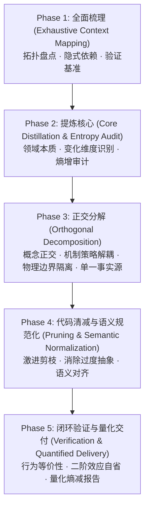

# 梳理清减 (Preening Substrate)

对目标模块进行结构性重构与代码清减，以项目当前工程现状为事实基准，参考业界经典设计模式与最佳实践。本技能严格遵循 **「先全面梳理，再提炼核心、正交分解」** 的认知演进法则，通过系统化、可度量的流水线实现软件架构的持续熵减。

---

## 核心心法与原则

### 道 (Mindset - 认知心法)

- **Context Quality First (上下文质量第一)**：重构绝非基于局部的关键字匹配或机械搬迁。不摸清全貌与真实依赖，盲目动工等同于制造隐式缺陷。
- **Entropy Reduction (熵减)**：通过剥离偶然复杂性（Accidental Complexity）、消除过度设计与死代码、正交化职责边界，对抗软件系统的无序膨胀。
- **Evolutionary Design (演进式设计)**：遵循奥卡姆剃刀与 YAGNI 原则，只做必要的抽象与解耦，不引入为未来假设埋单的冗余胶水层。
- **Second-Order Thinking (二阶思维)**：评估重构对上下游生态（调用链路、并发安全、配置兼容、状态生命周期）的“涟漪效应”，杜绝隐式破坏。

### 法 (Strategy - 架构原则)

- **Exhaustive Before Selective (先全貌后局部)**：严禁在未建立完整拓扑图谱前擅自切入局部修改。
- **Orthogonal Decomposition (正交分解)**：正交地提取概念主体。识别系统中独立变化的维度并彻底解耦（如机制与策略分离、业务与基础设施分离），确保单一概念主体的变更具备严格局部性。
- **Single Source of Truth (单一事实源)**：任何业务概念、状态与规则只允许有唯一的权威定义源，调用端使用轻量指针引用，杜绝多头状态与断裂风险。
- **Verification Before Done (交付前验证定式)**：严禁无证据交付。必须通过测试等价性自证与行数增减量化度量支撑交付结论。

---

## 执行管线 (5-Phase Execution Pipeline)



### Phase 1: 全面梳理 (Exhaustive Context Mapping)

> **目标**：建立目标模块的完备全景图谱，锚定基准事实与验证边界，严禁在此阶段进行任何破坏性修改。

1. **资产与入口全景盘点**：
   - 扫描模块内所有源文件、配置、导出符号（Classes, Functions, Types, Constants）；
   - 识别公开 API 与所有外部调用入口（Public API & Entrypoints）。
2. **拓扑与依赖链路追踪**：
   - 梳理上游输入与下游消费端，绘制模块调用拓扑；
   - 识别模块跨边界交互、I/O 操作及网络/数据库依赖。
3. **隐式依赖与副作用排查**：
   - 搜寻全局状态（Global State）、单例污染、模块级副作用、环境变量及动态反射调用；
   - 标记隐式时序依赖与生命周期耦合点。
4. **验证基准锚定 (Baseline Verification)**：
   - 盘点现有单元测试与集成测试覆盖；
   - 运行测试套件记录 Baseline 状态，确保在重构前具备可复现的验证护栏（若缺乏测试，需先行补充核心保护用例）。

### Phase 2: 提炼核心 (Core Distillation & Entropy Audit)

> **目标**：穿透繁芜表象，萃取模块本质，识别变化维度，列出熵增负债清单。

1. **本质复杂性萃取 (Domain Essence)**：
   - 区分本质复杂性（业务不可避免的固有逻辑）与偶然复杂性（历史包袱、临时补丁、过度封装）；
   - 确立该模块不可剥离的最小核心领域模型与核心职责。
2. **独立变化维度识别 (Dimensions of Change)**：
   - 识别驱动代码变更的正交力量：哪些是相对稳定的底座机制（Mechanism），哪些是高频变动的业务规则/策略（Policy）？
   - 识别数据模型、控制流程与交互适配等不同变化维度的边界。
3. **熵增负债审计 (Entropy Audit)**：
   - **过度抽象**：空洞的基类、仅有一个实现的接口套娃、过度设计的工厂与中间透传层（Pass-through layers）；
   - **死代码与冗余**：从未调用的私有方法、注释掉的历史废弃代码、不可达的分支、跨文件的重复拷贝（Copy-Paste）；
   - **语义失真**：名不副实或语意宽泛模糊的标识符（如 `DataHandler`, `Manager`, `Utils`）。

### Phase 3: 正交分解 (Orthogonal Decomposition)

> **目标**：重构概念拓扑与物理结构，实现高内聚、低耦合与单向依赖。

1. **概念主体正交化**：
   - 提取独立变化的概念主体，严格收敛每个主体的职责单一性；
   - 确保概念之间保持单向依赖（无环形依赖、无跨层反向调用）。
2. **机制与策略分离 (Mechanism vs. Policy)**：
   - 将稳定、通用的执行引擎/机制作为下层稳定底座；
   - 将业务策略、特定场景规则外置为可插拔、可组合的轻量构件。
3. **物理与目录边界隔离**：
   - 善用子目录/子路径强化物理边界，同一概念主体及其专属内聚逻辑置于同一子路径下；
   - 严禁模块间发生非公开契约的跨域深层穿透引用。
4. **建立单一事实源 (SSOT)**：
   - 统一同质逻辑，消除多头定义；
   - 引用时一律使用模块级明确导出的指针或直接引用，拒绝数据或逻辑的碎片化副本。

### Phase 4: 代码清减与语义规范化 (Pruning & Semantic Normalization)

> **目标**：外科手术式清理冗余，内联过度包装，重铸代码命名语义。

1. **激进剪枝与代码内联**：
   - 物理删除 Phase 2 审计确认的死代码、废弃分支与无用依赖；
   - 拍平不必要的中间代理层，内联无实际价值的简单包装函数与透传类；
   - 消除胶水代码与冗余类型转换。
2. **语义精准化重命名**：
   - 重新审视模块内全部命名（类、接口、函数、变量、文件、路径）；
   - 命名需精确表达其领域内涵，做到“见名知意、消除歧义”；
   - 保持全模块术语体系的一致性与严谨性。
3. **遵循专业术语规范**：
   - 行业公认且具明确技术语义的专业术语（如 Harness, Agent, Runtime, Benchmark, Pipeline, Prompt 等）直接保留英文原词，杜绝生硬直译。

### Phase 5: 闭环验证与量化交付 (Verification & Quantified Delivery)

> **目标**：提供客观自证材料，量化重构价值，确保零功能倒退。

1. **等价性与零回归验证**：
   - 重新运行全部单元测试、集成测试及类型检查；
   - 验证核心链路及边界 Case 的输出表现与重构前严格等价；
   - 针对二阶效应进行审查（检查对下游消费端、配置、序列化兼容性的影响）。
2. **量化交付汇报**：
   - 交付时必须输出量化统计表格（代码行数变更、删除死代码行数、净减少比例）；
   - 输出模块拓扑演进对比（Before vs. After 概念结构演进图或清单）。

---

## 交付规范与模板

每次执行本技能后，必须向用户输出符合以下格式的标准化交付报告：

```markdown
### 梳理清减交付报告：<模块名称>

#### 1. 全面梳理与核心提炼摘要

- **核心领域职责**：<该模块本质解决的核心问题>
- **解耦的正交维度**：<机制 vs 策略，独立变化的维度列表>
- **清理的熵增负债**：<消除的过度抽象、无用透传层与死代码类型>

#### 2. 结构性演进对比 (Architecture Evolution)

- **重构前结构 (As-is)**：
  - <原始结构/问题描述>
- **重构后正交结构 (To-be)**：
  - <重构后的子路径/概念主体划分>

#### 3. 熵减量化度量 (Entropy Metrics)

| 指标             | 改造前 (Before) | 改造后 (After) | 净变化 (Delta) | 优化率 (Reduction Rate) |
| :--------------- | :-------------- | :------------- | :------------- | :---------------------- |
| 代码总行数 (LOC) | `X` 行          | `Y` 行         | `-Z` 行        | `XX.X%`                 |
| 文件/模块数      | `N` 个          | `M` 个         | `±K` 个        | -                       |
| 冗余/死代码消除  | -               | -              | `-D` 行        | -                       |

#### 4. 验证自证结论

- [x] 自动化测试通过：`全部测试执行结果（通过数/耗时）`
- [x] 行为等价性自检：`边缘用例与对外契约验证结果`
- [x] 二阶效应审查：`上下游依赖链路兼容性确认`
```

---

## 执行约束 (Hard Constraints)

1. **功能完整性硬底线**：不得破坏现有功能特性，不得引入新缺陷，对外公开 API 契约变更须具备向后兼容性或明确迁移指引。
2. **禁止盲目重构**：未完成 Phase 1（梳理）与 Phase 2（提炼）前，严禁直接进入 Phase 3/4 改写业务代码。
3. **最小干预与渐进演进**：严禁无视工程现状搞推倒重来式革命，每一阶段演进须保持系统处于随时可验证的可运行状态。
4. **遵循 AGENTS.md 准则**：严格执行低熵表达、Git 规范、测试控制及专业术语约束。
